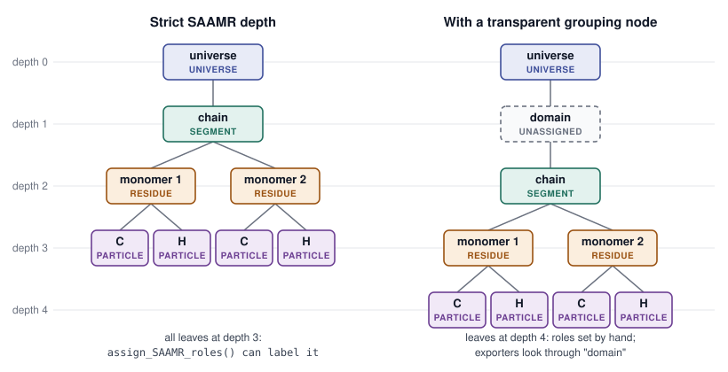

Meaning Across Scales: Roles, Depth, and SAAMR
===============================================

.. DRAFT (Joe): this page is a first draft generated for review. Comments
   starting with "DRAFT" are open questions and are not rendered. Remove
   them before merging.

A MuPT representation is a tree of :class:`~mupt.mupr.primitives.Primitive`
objects. The tree can be as deep or as shallow as a problem needs: a
polymer melt might be a universe of chains, each chain a sequence of
repeat units, each repeat unit a set of atoms; a block copolymer might add
a level for blocks; a coarse-grained model might stop at beads. MuPT does
not assign any fixed meaning to a given depth in the tree. This is what
allows the same data structure to describe a system at many resolutions.

Most of the tools MuPT hands systems off to do not work this way.
MDAnalysis organizes a system into a fixed hierarchy of
`segments, residues, and atoms
<https://userguide.mdanalysis.org/stable/groups_of_atoms.html>`_. The PDB
format expects `chains, residue numbers, and atoms
<https://www.wwpdb.org/documentation/file-format>`_. RDKit is flatter: a
``Mol`` is a graph of atoms and bonds that may contain several disconnected
fragments, but it has no built-in notion of residues or of which fragment
is which beyond connectivity. Each of these tools has its own fixed set of
levels, and each level has a specific meaning.

*Roles* are how MuPT translates its hierarchy into the levels these tools
expect. A role is an explicit label on a Primitive that says what that
Primitive *means* to the outside world, independent of where it sits in
the tree.

Why depth is not enough
-----------------------

The simplest way to map a MuPT tree onto an external toolkit is to assume
a layout: the root is the system, its children are molecules, their
children are residues, and their children are atoms. 

That assumption breaks as soon as a tree has a different shape. Adding a
single grouping level (for example, collecting chains into a "domain", or
residues into blocks) shifts every atom one level deeper, and a
depth-based exporter will mislabel residues as segments and atoms
as residues. Worse, different parts of the code could disagree about
ordering, producing topologies whose residues were scrambled relative to
their coordinates.

The underlying problem is that depth is *structural* information, while
"this is a residue" is *semantic* information. Roles make the semantic
information explicit, so exporters never have to infer it from depth.

What a role is
--------------

Every Primitive has a :attr:`~mupt.mupr.primitives.Primitive.role`
attribute, whose value is a member of the
:class:`~mupt.roles.PrimitiveRole` enum:

``UNIVERSE``
    The root container of the whole system.

``SEGMENT``
    A covalently self-contained entity, such as a polymer chain, a small
    molecule, or an ion. Nothing is bonded *between* segments.

``RESIDUE``
    A repeating sub-unit of a segment, such as a monomer or an amino acid.

``PARTICLE``
    The smallest exported unit. In an all-atom representation this is an
    atom. In a CG representation, this may be a single coarse-grained bead.

``UNASSIGNED``
    The default. An unassigned Primitive has no meaning to an exporter and
    is treated as a *transparent* grouping node: exporters look through it
    to the role-bearing Primitives beneath.

A few properties of roles are worth knowing:

- **Roles are opt-in.** MuPT never assigns roles on its own. Either you set
  them when building a Primitive (``Primitive(..., role=PrimitiveRole.RESIDUE)``),
  set them afterwards (``prim.role = PrimitiveRole.RESIDUE``), or call a
  helper such as :func:`~mupt.roles.assign_SAAMR_roles`.
- **Roles are preserved by copying.** ``Primitive.copy()`` carries roles
  through to the copied tree, so a residue template tagged once stays
  tagged when it is copied into many chains.
- **Roles do not affect identity.** Two Primitives that differ only in
  their roles compare equal and have the same canonical form. A role
  describes how a Primitive should be *presented* to other tools, not what
  it *is* chemically.

.. DRAFT (reply to JRL note): #112 fixed a different thing -- it made
   copy() keep roles (issue #98). It did not touch equality: on current main,
   Primitive(label="x") == Primitive(label="x", role=SEGMENT) is still True,
   and canonical_form() is identical. So the open question for Tim is only
   whether that is intended, and whether role stays a core attribute after
   #56. If you'd rather not raise it, this bullet is accurate as written.

Standard All-Atom Molecular Representation (SAAMR)
--------------------------------------------------

The four non-default roles are not arbitrary. Together they form one
particular convention, the **Standard All-Atom Molecular Representation
(SAAMR)**, which mirrors the universe / segment / residue / atom hierarchy
used by MDAnalysis and, more loosely, by most biomolecular and polymer
file formats.

.. list-table:: SAAMR roles and their counterparts
   :header-rows: 1
   :widths: 15 25 20 20 20

   * - Role
     - Meaning
     - MDAnalysis
     - RDKit
     - PDB
   * - ``UNIVERSE``
     - the whole system
     - ``Universe``
     - (set of Mols)
     - the file
   * - ``SEGMENT``
     - one covalent entity
     - segment
     - one ``Mol``
     - chain (see note below)
   * - ``RESIDUE``
     - repeat unit / monomer
     - residue
     - atom properties
     - residue
   * - ``PARTICLE``
     - atom
     - atom
     - atom
     - atom

SAAMR is *a* system of roles, not the only possible one. It is the system
that MuPT's current all-atom exporters and builders understand, which is
why it gets a name. Other conventions (for example, coarse-grained
hierarchies, or labels for functional groups, Kuhn segments, or
sticker/spacer units) are natural extensions of the same idea; see
`Beyond SAAMR`_.

Roles versus depth in practice
------------------------------

The simplest SAAMR tree is one where the roles and the depths line up
exactly: universe at depth 0, segments at depth 1, residues at depth 2,
and atoms at depth 3. MuPT calls this *strict SAAMR depth*, and for trees
with this shape, :func:`~mupt.roles.assign_SAAMR_roles` will label every
level for you:

.. code-block:: python

    from mupt.chemistry import ELEMENTS
    from mupt.mupr.primitives import Primitive
    from mupt.mupr.properties import has_strict_SAAMR_depth
    from mupt.roles import assign_SAAMR_roles, has_SAAMR_roles

    universe = Primitive(label="universe")
    chain = Primitive(label="chain")
    unit = Primitive(label="HEL")
    atom = Primitive(label="He", element=ELEMENTS[2])

    universe.attach_child(chain)
    chain.attach_child(unit)
    unit.attach_child(atom)

    has_strict_SAAMR_depth(universe)  # True: every leaf is an atom at depth 3
    has_SAAMR_roles(universe)         # False: nothing is labelled yet

    assign_SAAMR_roles(universe)
    has_SAAMR_roles(universe)         # True

Real systems are often not this tidy. Suppose the chain is grouped under
an extra "domain" node. The atom now sits at depth 4, so the tree no
longer has strict SAAMR depth and ``assign_SAAMR_roles`` will refuse to
guess, raising a ``ValueError``. The roles can still be set by hand, and
the domain node is simply left ``UNASSIGNED``:

.. code-block:: python

    from mupt.interfaces.mdanalysis import primitive_to_mdanalysis
    from mupt.roles import PrimitiveRole

    universe = Primitive(label="universe", role=PrimitiveRole.UNIVERSE)
    domain = Primitive(label="domain")  # UNASSIGNED: transparent
    chain = Primitive(label="chain", role=PrimitiveRole.SEGMENT)
    unit = Primitive(label="HEL", role=PrimitiveRole.RESIDUE)
    atom = Primitive(label="He", element=ELEMENTS[2], role=PrimitiveRole.PARTICLE)

    universe.attach_child(domain)
    domain.attach_child(chain)
    chain.attach_child(unit)
    unit.attach_child(atom)

    has_strict_SAAMR_depth(universe)  # False: the atom is at depth 4
    has_SAAMR_roles(universe)         # True

    u = primitive_to_mdanalysis(universe, resname_map={})
    # 1 segment, 1 residue ("HEL"), 1 atom -- the domain level is looked through

**Depth describes how a tree is
organized; roles describe what its parts mean.** The two coincide in a
strict SAAMR tree, but exporters only ever rely on the roles.

It helps to keep the three checks straight:

:func:`~mupt.mupr.properties.has_strict_SAAMR_depth`
    A *structural* check: are all leaves atoms at depth exactly 3? This is
    the precondition for :func:`~mupt.roles.assign_SAAMR_roles`.

:func:`~mupt.roles.has_SAAMR_roles`
    A quick *presence* check: does at least one Primitive carry each of the
    four SAAMR roles? It does not check how those roles are arranged.

Every exporter for SAAMR systems
    confirms SAAMR compliance before writing anything and raises a
    ``ValueError`` explaining what is wrong.

.. DRAFT (reply to JRL): has_SAAMR_roles has never been called in
   production or in tests. You added it in 73a7155 ("add has_SAAMR_roles for
   role-presence checking") on 2026-04-09 during the #50 review, alongside
   d1ba340, which renamed is_SAAMR_compliant to has_strict_SAAMR_depth after
   Tim noted export was still depth-bound. The exporters went on to
   use their own validator (build_saamr_role_topology_index in the private
   mupt.interfaces._shared.topology) instead. Agreed it looks like an
   oversight. The natural fix is to have has_SAAMR_roles return whether
   build_saamr_role_topology_index succeeds, so it checks arrangement too.
   That is a code change (small separate PR or issue); once it lands, the
   description above should change to "a full arrangement check".

:func:`~mupt.roles.assign_SAAMR_roles` always labels every level of a
strict SAAMR tree, replacing any roles that were set before. To keep
hand-assigned roles, set the remaining ones by hand instead of calling it.

How to build a SAAMR tree
-------------------------

A tree can be exported as SAAMR when it satisfies the rules below. Note
that they are stated in terms of roles, not depth:

1. The root has the ``UNIVERSE`` role.
2. Every leaf is a ``PARTICLE`` with an element, and only leaves are
   ``PARTICLE``\ s.
3. Every ``PARTICLE`` is contained (at any depth) in a ``RESIDUE``, and
   every ``RESIDUE`` in a ``SEGMENT``.
4. ``SEGMENT``\ s do not contain other ``SEGMENT``\ s, and ``RESIDUE``\ s
   do not contain other ``RESIDUE``\ s.
5. No ``SEGMENT`` is empty of residues, and no ``RESIDUE`` is empty of
   particles.
6. Bonds are owned at or below the ``SEGMENT`` level. A Primitive above
   any segment may not own internal connections, because a bond there
   would join two segments that are supposed to be covalently separate.

         SEGMENT, RESIDUE and PARTICLE at depths 0 to 3. Right, the same
         system with an UNASSIGNED domain node between the universe and
         the chain, so the atoms sit at depth 4.
   :width: 100%

   The same system with and without a transparent grouping node. Both
   trees are valid SAAMR: the exporters see one segment, two residues and
   four atoms either way. Only the left tree has strict SAAMR depth.

.. DRAFT: prototype figure (docs/explanation/images/saamr_role_tree.svg);
   replace with your own version if you like.

Anything else is allowed. In particular, ``UNASSIGNED`` Primitives may
appear anywhere between these levels: between the universe and its
segments, between a segment and its residues, or between a residue and
its atoms.

Rule 6 is what gives ``SEGMENT`` its meaning. Everything covalently bonded
together belongs to one segment, which is why a segment maps cleanly onto
a single RDKit ``Mol`` or a single MDAnalysis segment.

How roles are used
------------------

MDAnalysis export
    :func:`~mupt.interfaces.mdanalysis.exporters.primitive_to_mdanalysis`
    turns each ``SEGMENT`` into an MDAnalysis segment, each ``RESIDUE``
    into a residue, and each ``PARTICLE`` into an atom, in a deterministic
    order. Residue names come from the residue's ``"residue_name"``
    metadata if present, then from ``resname_map``, then from its label,
    and must be three characters long.

RDKit export
    :func:`~mupt.interfaces.rdkit.exporters.primitive_to_rdkit_mols`
    yields one RDKit ``Mol`` per ``SEGMENT``. Residue and particle
    membership is recorded on each RDKit atom as properties
    (``mupt_segment_index``, ``mupt_residue_index``, and so on), so the
    SAAMR hierarchy can be recovered from the molecule.

    .. note::

       The PDB chain IDs and residue numbers written on these molecules
       are placeholders to satisfy the PDB format's limits (residue
       numbers roll over into the next chain letter after 9999). They do
       **not** encode segment identity; use the ``mupt_*`` atom properties
       for that.

SDF files
    MuPT's SDF writer is built on the RDKit exporter. The reader rebuilds a
    strict four-level UNIVERSE / SEGMENT / RESIDUE / PARTICLE tree, so
    transparent ``UNASSIGNED`` levels are not preserved through a round
    trip.

All-atom DPD initialization
    :class:`~mupt.builders.all_atom_dpd.AllAtomDPDBuilder` uses the same
    role rules to find the chains, residues, and atoms it needs to place
    and relax. The geometric placement step itself is role-agnostic; the
    builder is the layer that reads roles and hands placement a
    chain-of-residues view of each segment.

Beyond SAAMR
------------

SAAMR is the first role system MuPT supports. Exporters are
built around interchangeable *strategies* (for example, an all-atom
strategy for MDAnalysis), so a different role convention, such as a
coarse-grained hierarchy where ``PARTICLE``\ s are beads, can be supported
by adding a strategy rather than rewriting the exporter.

What is fixed is the principle: meaning is attached to Primitives
explicitly, and tools that need a fixed hierarchy read that meaning
instead of guessing it from the shape of the tree.

.. DRAFT: forward-looking. Decide with the team whether future role
   vocabularies extend PrimitiveRole or get separate enums, and whether to
   reference #56 / #109 here.

See also
--------

- :mod:`mupt.roles` and :mod:`mupt.mupr.properties` in the API reference
- :doc:`molecular_representation`, for the Primitive tree itself
- :doc:`connectors`, for how bonds between Primitives are represented
